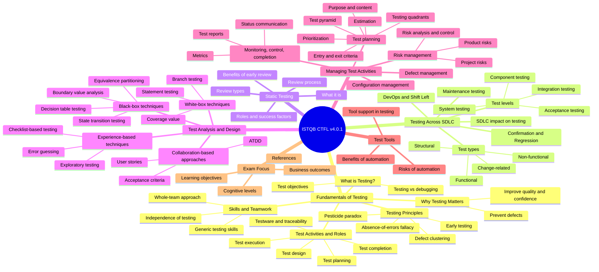

# ISTQB CTFL v4.0.1 Mind Map

This is a compact study map for fast learning and revision.

## Quick memory tip
- Think of ISTQB as 6 main pillars: fundamentals, lifecycle, static testing, design techniques, test management, and tools.
- If you remember the test design techniques first, you will usually answer many exam questions more quickly.
- For revision, focus on definitions, test levels, risks, and the difference between static and dynamic testing.
