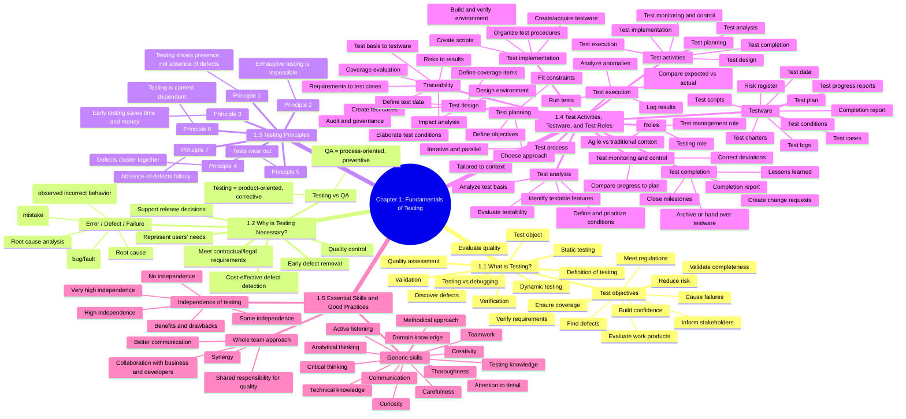

# ISTQB CTFL v4.0.1 Chapter 1 Mind Map

This is a detailed study map for Chapter 1: Fundamentals of Testing. Start here if you want to build a strong foundation.

## Best way to study Chapter 1
1. Learn the definitions first: testing, verification, validation, defect, failure, root cause.
2. Memorize the seven testing principles.
3. Understand the test process and its seven activities.
4. Learn the meaning of testware and traceability.
5. Review the essential skills and the value of independence.

## Quick exam tip
If you remember only three things from Chapter 1, remember:
- testing is for quality and risk reduction
- the test process has clear activities from planning to completion
- the seven principles guide how testing should be done
