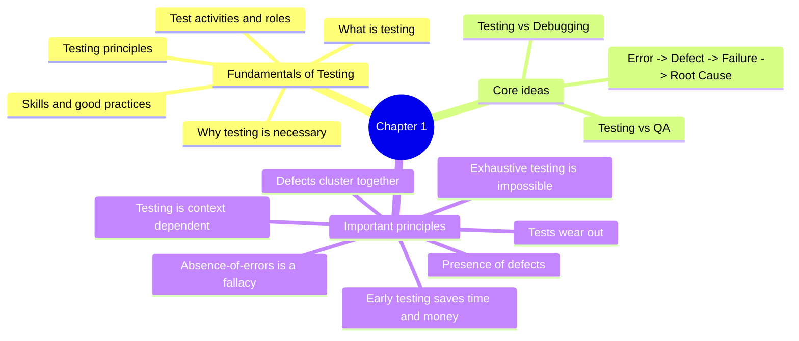

# Chapter 1 Mind Map

```mermaid
mindmap
  root((Chapter 1))
    Fundamentals of Testing
      What is testing
      Why testing is necessary
      Testing principles
      Test activities and roles
      Skills and good practices
    Core ideas
      Error -> Defect -> Failure -> Root Cause
      Testing vs Debugging
      Testing vs QA
    Important principles
      Presence of defects
      Exhaustive testing is impossible
      Early testing saves time and money
      Defects cluster together
      Tests wear out
      Testing is context dependent
      Absence-of-errors is a fallacy
```
