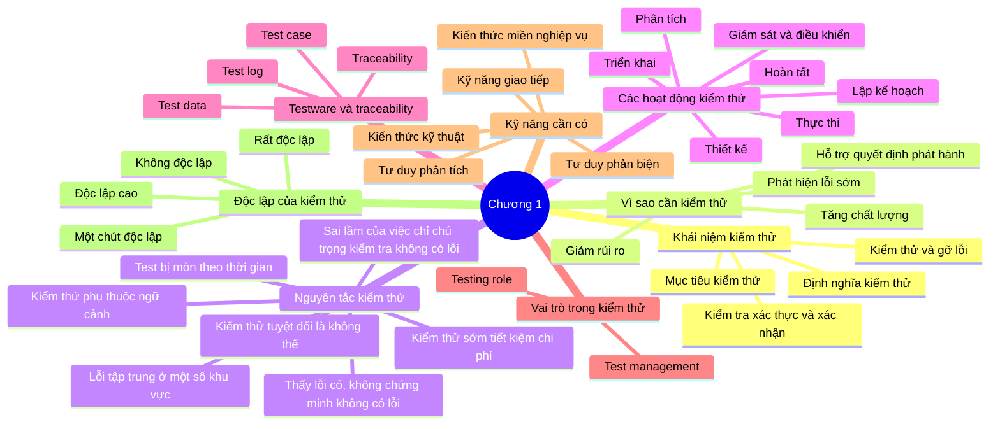

# Sơ đồ tư duy Chương 1 (Tiếng Việt)

## Chương 1: Cơ bản về kiểm thử

```mermaid
mindmap
  root((Chương 1))
    Khái niệm kiểm thử
      Định nghĩa kiểm thử
      Mục tiêu kiểm thử
      Kiểm thử và gỡ lỗi
      Kiểm tra xác thực và xác nhận
    Vì sao cần kiểm thử
      Tăng chất lượng
      Phát hiện lỗi sớm
      Giảm rủi ro
      Hỗ trợ quyết định phát hành
    Nguyên tắc kiểm thử
      Thấy lỗi có, không chứng minh không có lỗi
      Kiểm thử tuyệt đối là không thể
      Kiểm thử sớm tiết kiệm chi phí
      Lỗi tập trung ở một số khu vực
      Test bị mòn theo thời gian
      Kiểm thử phụ thuộc ngữ cảnh
      Sai lầm của việc chỉ chú trọng kiểm tra không có lỗi
    Các hoạt động kiểm thử
      Lập kế hoạch
      Giám sát và điều khiển
      Phân tích
      Thiết kế
      Triển khai
      Thực thi
      Hoàn tất
    Testware và traceability
      Test case
      Test data
      Test log
      Traceability
    Vai trò trong kiểm thử
      Test management
      Testing role
    Kỹ năng cần có
      Kỹ năng giao tiếp
      Tư duy phân tích
      Tư duy phản biện
      Kiến thức kỹ thuật
      Kiến thức miền nghiệp vụ
    Độc lập của kiểm thử
      Không độc lập
      Một chút độc lập
      Độc lập cao
      Rất độc lập
```
