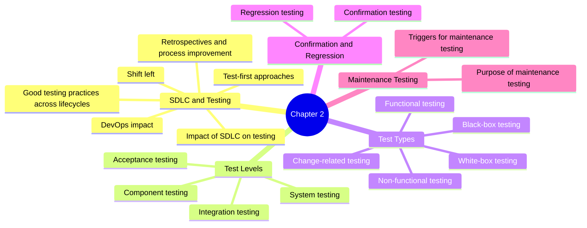

# ISTQB Chapter 2 Mind Map

## Chapter 2: Testing Throughout the Software Development Lifecycle

## Study focus
- Understand how testing changes depending on the development lifecycle.
- Learn the differences between test levels and test types.
- Remember the meaning of shift left and DevOps in testing.
