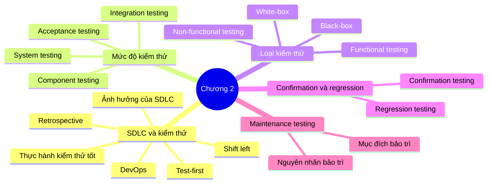

# Sơ đồ tư duy Chương 2 (Tiếng Việt)

## Chương 2: Kiểm thử trong vòng đời phát triển phần mềm

```mermaid
mindmap
  root((Chương 2))
    SDLC và kiểm thử
      Ảnh hưởng của SDLC
      Thực hành kiểm thử tốt
      Test-first
      DevOps
      Shift left
      Retrospective
    Mức độ kiểm thử
      Component testing
      Integration testing
      System testing
      Acceptance testing
    Loại kiểm thử
      Functional testing
      Non-functional testing
      Black-box
      White-box
    Confirmation và regression
      Confirmation testing
      Regression testing
    Maintenance testing
      Nguyên nhân bảo trì
      Mục đích bảo trì
```