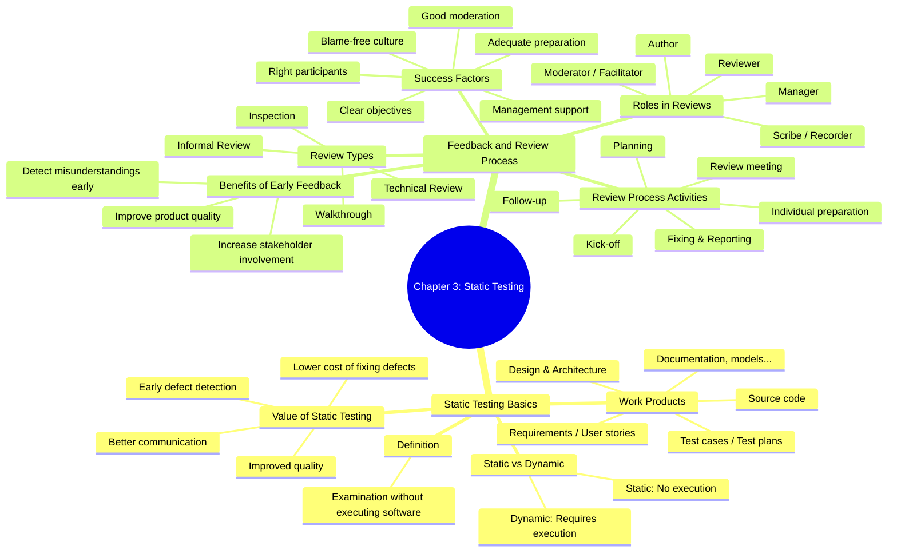

# ISTQB Chapter 3 Mind Map

## Chapter 3: Static Testing

## Study focus
- Static testing does not execute the software.
- Reviews are an important part of static testing.
- Know the main review types and their benefits.
