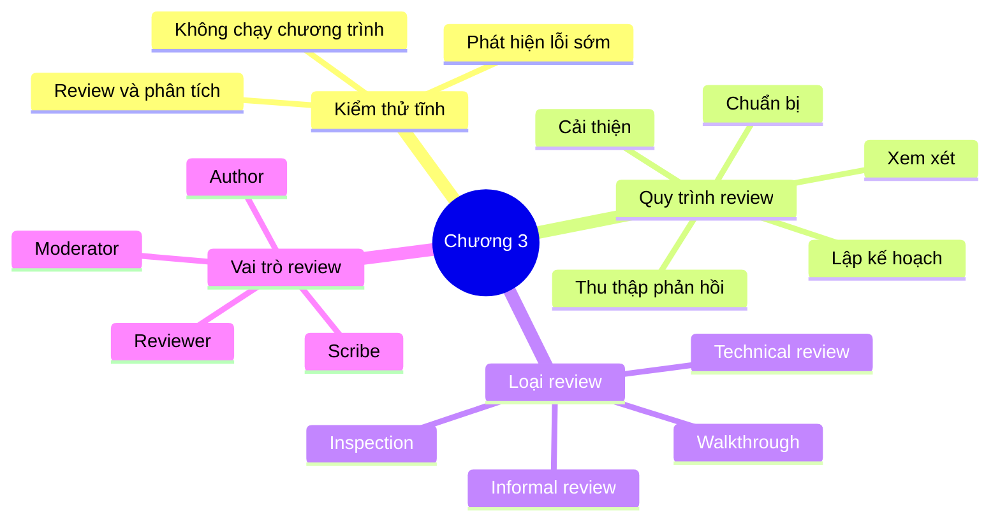

# Sơ đồ tư duy Chương 3 (Tiếng Việt)

## Chương 3: Kiểm thử tĩnh

```mermaid
mindmap
  root((Chương 3))
    Kiểm thử tĩnh
      Không chạy chương trình
      Review và phân tích
      Phát hiện lỗi sớm
    Quy trình review
      Lập kế hoạch
      Chuẩn bị
      Xem xét
      Thu thập phản hồi
      Cải thiện
    Loại review
      Informal review
      Walkthrough
      Technical review
      Inspection
    Vai trò review
      Author
      Reviewer
      Moderator
      Scribe
```