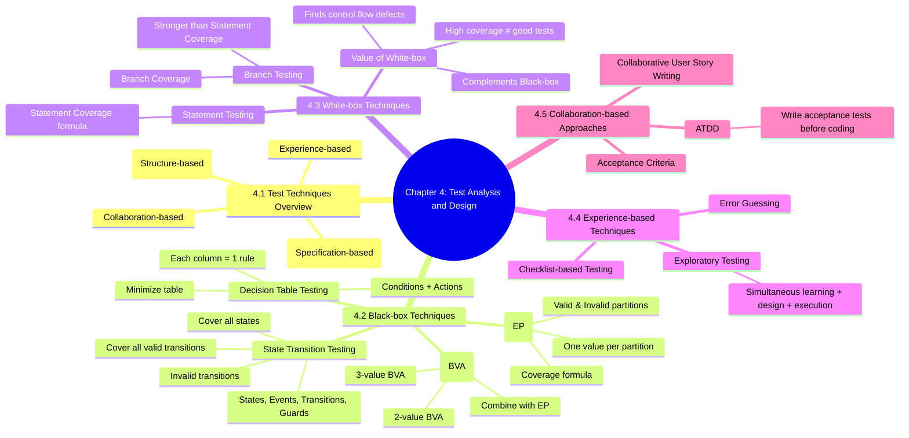

# ISTQB Chapter 4 Mind Map

## Chapter 4: Test Analysis and Design

## Study focus
- Learn the main test design techniques.
- Understand the difference between black-box and white-box testing.
- Practice how acceptance criteria and ATDD support testing.
