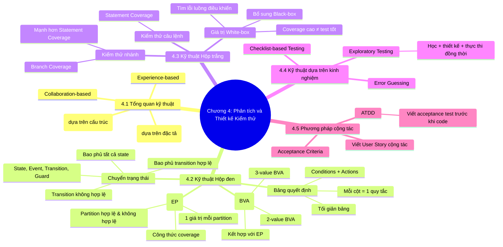

# Sơ đồ tư duy Chương 4 (Tiếng Việt)

## Chương 4: Phân tích và thiết kế kiểm thử

```mermaid
mindmap
  root((Chương 4: Phân tích và Thiết kế Kiểm thử))
    4.1 Tổng quan kỹ thuật
      Black-box (dựa trên đặc tả)
      White-box (dựa trên cấu trúc)
      Experience-based
      Collaboration-based
    4.2 Kỹ thuật Hộp đen
      Phân vùng tương đương (EP)
        Partition hợp lệ & không hợp lệ
        1 giá trị mỗi partition
        Công thức coverage
      Phân tích giá trị biên (BVA)
        2-value BVA
        3-value BVA
        Kết hợp với EP
      Bảng quyết định
        Conditions + Actions
        Mỗi cột = 1 quy tắc
        Tối giản bảng
      Chuyển trạng thái
        State, Event, Transition, Guard
        Bao phủ tất cả state
        Bao phủ transition hợp lệ
        Transition không hợp lệ
    4.3 Kỹ thuật Hộp trắng
      Kiểm thử câu lệnh
        Statement Coverage
      Kiểm thử nhánh
        Branch Coverage
        Mạnh hơn Statement Coverage
      Giá trị White-box
        Tìm lỗi luồng điều khiển
        Bổ sung Black-box
        Coverage cao ≠ test tốt
    4.4 Kỹ thuật dựa trên kinh nghiệm
      Error Guessing
      Exploratory Testing
        Học + thiết kế + thực thi đồng thời
      Checklist-based Testing
    4.5 Phương pháp cộng tác
      Viết User Story cộng tác
      Acceptance Criteria
      ATDD
        Viết acceptance test trước khi code
```