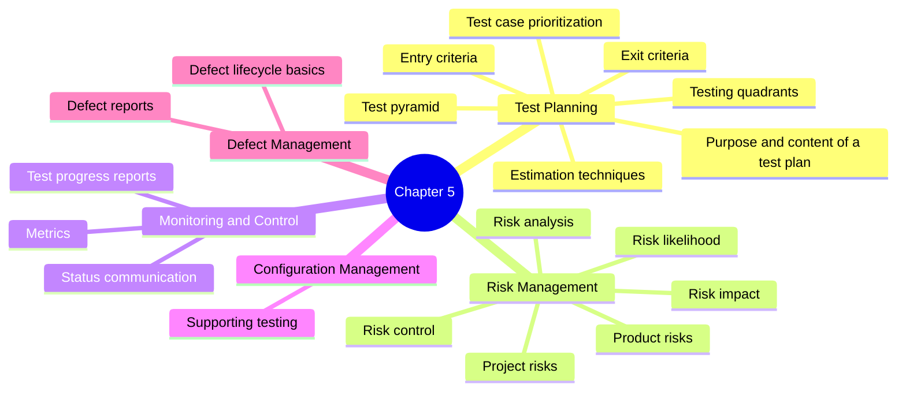

# ISTQB Chapter 5 Mind Map

## Chapter 5: Managing the Test Activities

## Study focus
- Understand how tests are planned and controlled.
- Learn the difference between project and product risks.
- Remember the basics of reporting, configuration management, and defect management.
