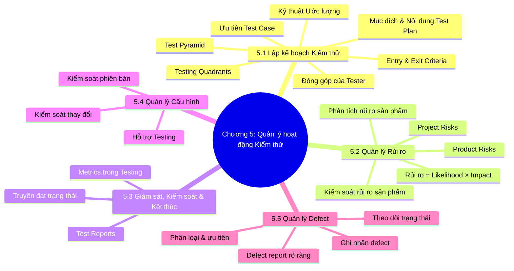

# Sơ đồ tư duy Chương 5 (Tiếng Việt)

## Chương 5: Quản lý các hoạt động kiểm thử

```mermaid
mindmap
  root((Chương 5: Quản lý hoạt động Kiểm thử))
    5.1 Lập kế hoạch Kiểm thử
      Mục đích & Nội dung Test Plan
      Đóng góp của Tester
      Entry & Exit Criteria
      Kỹ thuật Ước lượng
      Ưu tiên Test Case
      Test Pyramid
      Testing Quadrants
    5.2 Quản lý Rủi ro
      Rủi ro = Likelihood × Impact
      Project Risks
      Product Risks
      Phân tích rủi ro sản phẩm
      Kiểm soát rủi ro sản phẩm
    5.3 Giám sát, Kiểm soát & Kết thúc
      Metrics trong Testing
      Test Reports
      Truyền đạt trạng thái
    5.4 Quản lý Cấu hình
      Kiểm soát phiên bản
      Kiểm soát thay đổi
      Hỗ trợ Testing
    5.5 Quản lý Defect
      Ghi nhận defect
      Phân loại & ưu tiên
      Theo dõi trạng thái
      Defect report rõ ràng
```