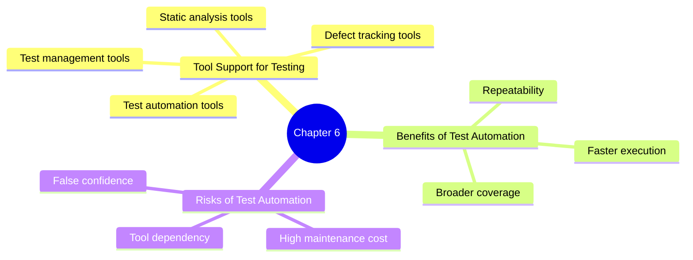

# ISTQB Chapter 6 Mind Map

## Chapter 6: Test Tools

## Study focus
- Understand why tools are used in testing.
- Know the main benefits and risks of automation.
- Remember that tools support testing but do not replace thinking and judgment.
